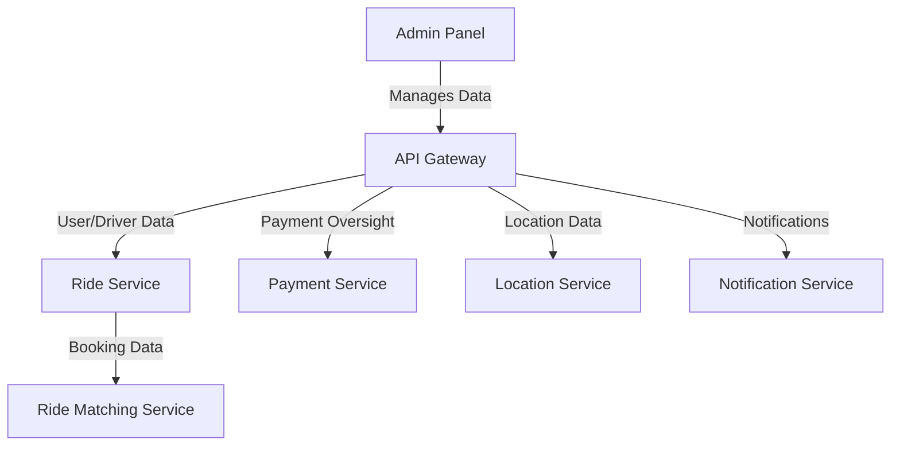

# Admin Panel

The Admin Panel is a web-based interface for managing the ride-booking system, providing oversight of users, drivers, payments, and operational data.

## Key Features
- User and Driver Management
- Fare and Pricing Management
- Analytics and Reporting
- Customer Support Tools

## Recommended Tech Stack
- **Frontend**: React.js or Angular for a responsive web interface [3].
- **Backend**: Node.js with Express.js for handling admin requests and data management [1][3].
- **Database**: MySQL or PostgreSQL for storing user/driver data and analytics [1][3].
- **Authentication**: Firebase or custom JWT for secure admin access.

## System Design Structure
- **Web Interface**: Built with React.js for dynamic dashboards and data visualization.
- **API Integration**: Connects to API Gateway for accessing backend data.
- **Analytics Engine**: Processes ride and user data for reporting, using custom scripts or Apache Hive [1].
- **Admin Authentication**: Secures access with role-based permissions.

## Architecture Diagram

## Interaction with Other Services
The Admin Panel interacts with backend services through the API Gateway:
- **API Gateway**: Routes admin requests for data and updates.
- **Ride Service**: Provides booking and user/driver data.
- **Payment Service**: Manages transaction oversight and refunds.
- **Location Service**: Supplies location analytics.
- **Notification Service**: Sends bulk updates to users/drivers.
- **Ride Matching Service**: Offers matching efficiency data.

